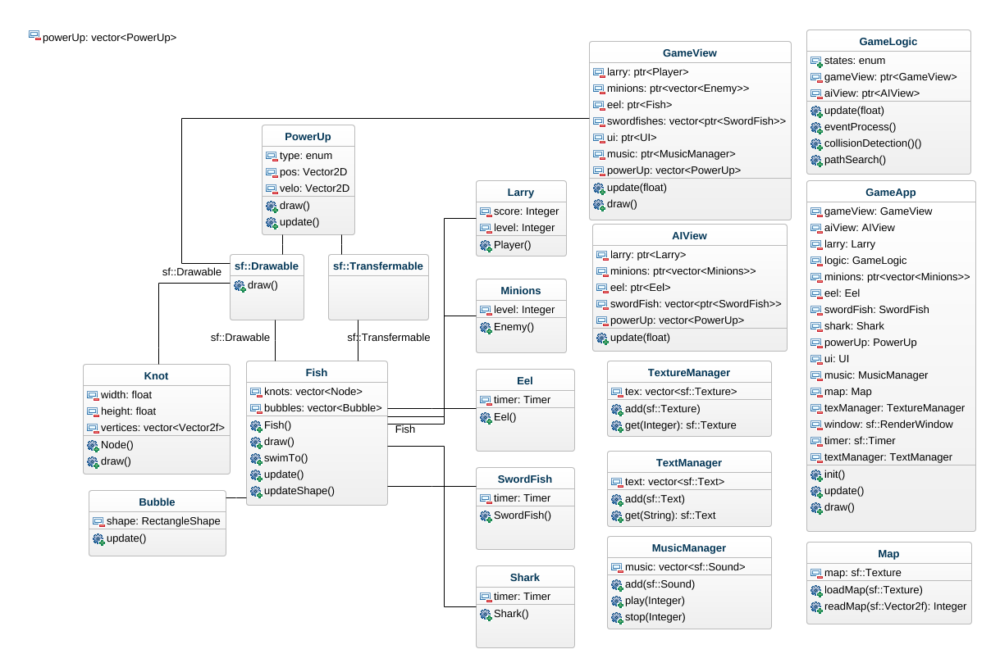
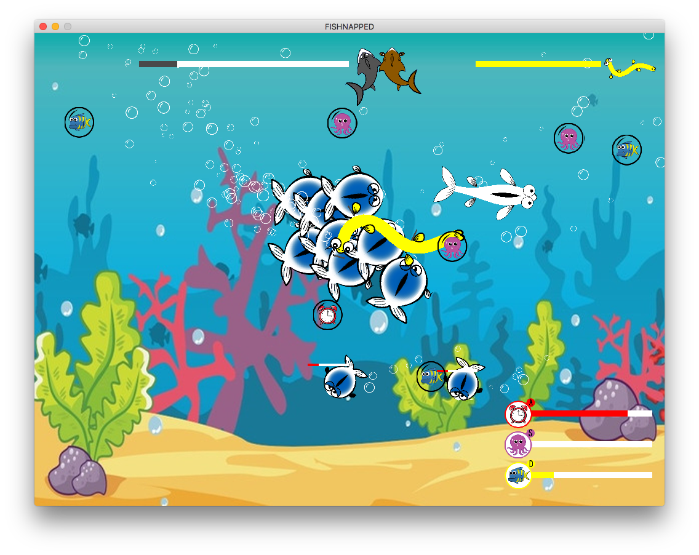
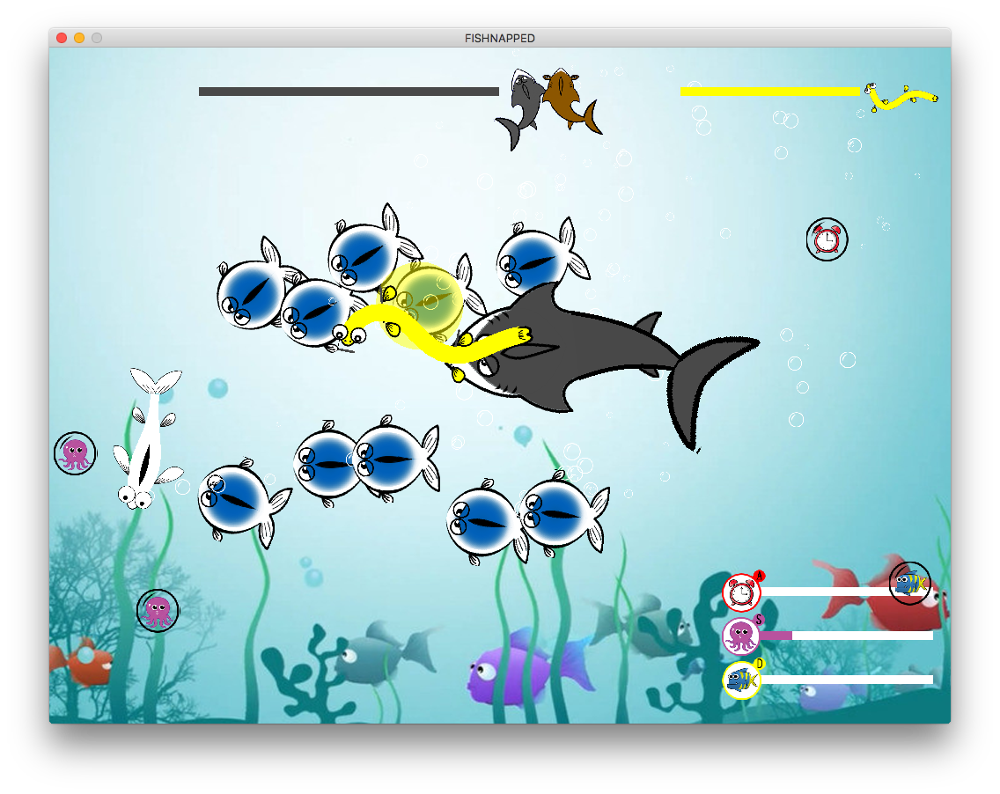
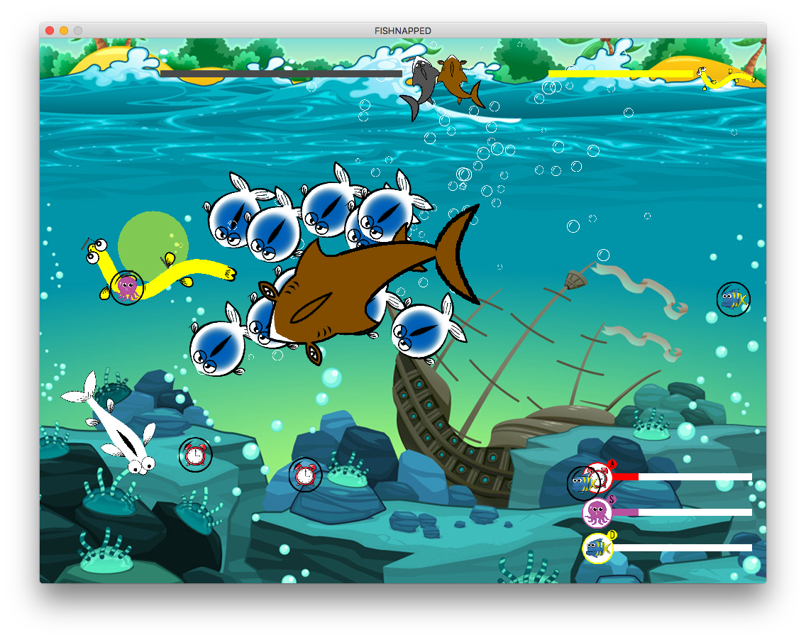
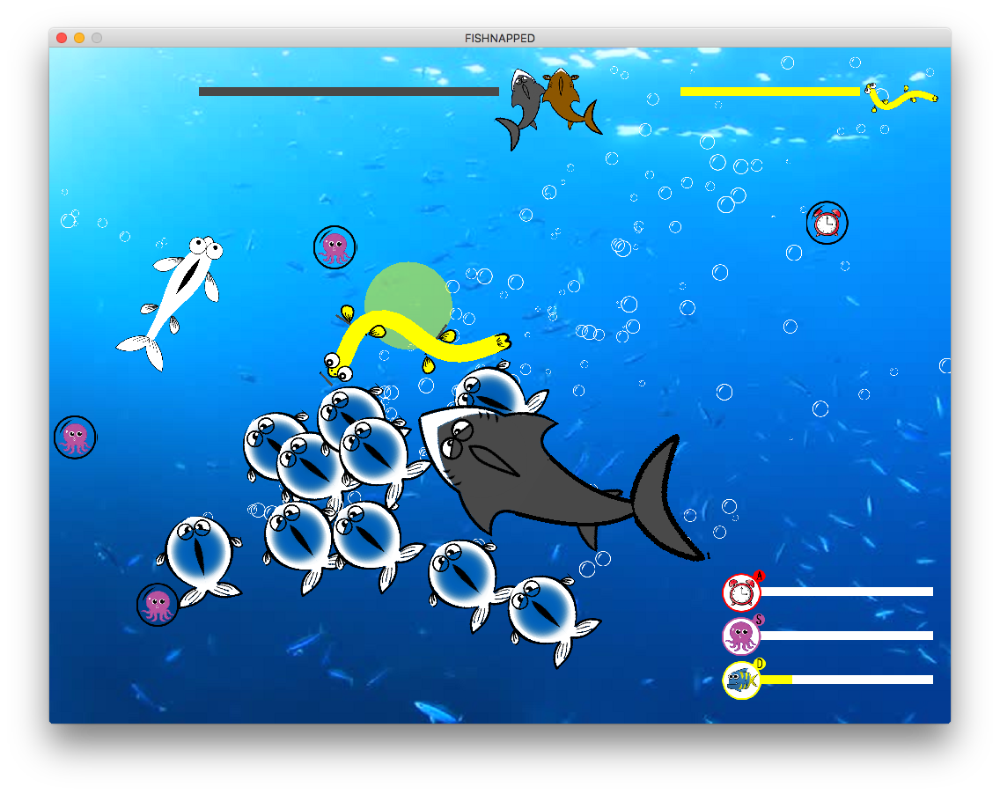
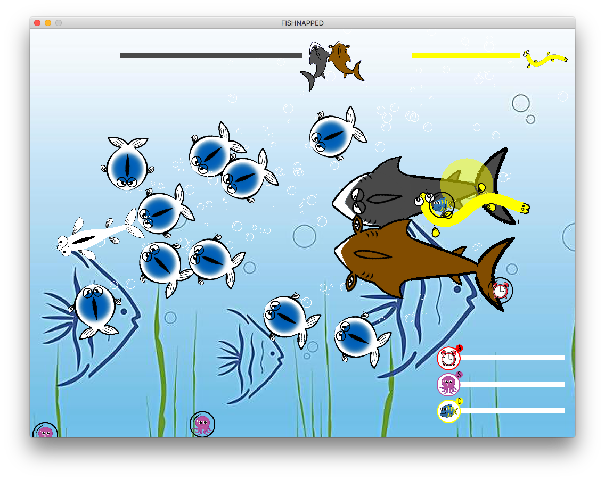

# game_design
This repository is for the "Introduction of Game Design" course of College of William and Mary

The framework is based on Professor Pieter Peers' Pong game framework.

## Developers

Jonathan Lin, Stephen Tung, Jimmy Wei, Xiaodan Zhu

## Compile Instruction

Create a folder named Debug/Release (related to the compile mode you want), and locate into the directory.
```
mkdir Debug
cd Debug
```

Create Makefile by CMake.
```
cmake ..
```

Compile the program.

```
make
```

Run the game

```
./FISHNAPPED
```

Follow the instructions and enjoy!

Our classes inherit UML graph.



There are five levels.

Level 1:



Level 2:



Level 3:



Level 4:



Level 5:


